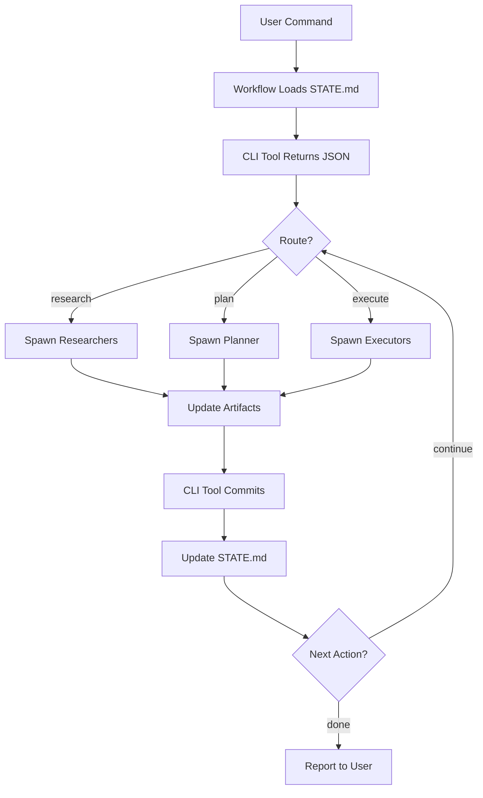

## System Design

GSD is a **context engineering and meta-prompting system** built on a foundation of specialized agents, structured artifacts, and wave-based execution. The architecture prioritizes:

- **Context efficiency** — Orchestrators stay lean (~10-15%), subagents get fresh 200K contexts
- **Modular workflows** — Each workflow is independent, composable, and resumable
- **State persistence** — Every decision, position, and blocker tracked across sessions
- **Parallel execution** — Independent work runs simultaneously via wave coordination

### Core Principles

<Info>
**Orchestrator Pattern**: Thin coordinators spawn specialized agents. The orchestrator NEVER does heavy lifting — it discovers, routes, waits, and integrates results.
</Info>

**Context degradation awareness**: Claude's quality drops as context fills:

| Context Usage | Quality | Claude's State |
|---------------|---------|----------------|
| 0-30% | PEAK | Thorough, comprehensive |
| 30-50% | GOOD | Confident, solid work |
| 50-70% | DEGRADING | Efficiency mode begins |
| 70%+ | POOR | Rushed, minimal |

GSD keeps orchestrators lean and spawns fresh subagents to avoid degradation.

## Directory Structure

### Source Repository (`get-shit-done/`)

```
get-shit-done/
├── workflows/           # Orchestrator workflows (one per command)
│   ├── new-project.md
│   ├── plan-phase.md
│   ├── execute-phase.md
│   ├── verify-work.md
│   └── ...
├── templates/           # Document templates
│   ├── project.md
│   ├── state.md
│   ├── roadmap.md
│   ├── requirements.md
│   ├── summary.md
│   └── ...
├── references/          # Shared knowledge modules
│   ├── verification-patterns.md
│   ├── questioning.md
│   ├── model-profiles.md
│   ├── git-integration.md
│   └── ...
└── bin/                 # Node.js CLI tools
    ├── gsd-tools.cjs    # Core utilities
    └── lib/
        ├── config.cjs
        ├── roadmap.cjs
        ├── state.cjs
        └── ...
```

### Agent Definitions (`agents/`)

```
agents/
├── gsd-planner.md              # Creates phase plans
├── gsd-executor.md             # Executes plans atomically
├── gsd-verifier.md             # Verifies goal achievement
├── gsd-plan-checker.md         # Validates plan quality
├── gsd-phase-researcher.md     # Domain research
├── gsd-project-researcher.md   # Project-level research
├── gsd-research-synthesizer.md # Aggregates research
├── gsd-roadmapper.md           # Creates roadmaps
├── gsd-debugger.md             # Systematic debugging
├── gsd-codebase-mapper.md      # Brownfield analysis
├── gsd-integration-checker.md  # Integration validation
└── gsd-nyquist-auditor.md      # Test coverage auditing
```

### Project Artifacts (`.planning/`)

Created in each user project:

```
.planning/
├── PROJECT.md              # Vision, always loaded
├── REQUIREMENTS.md         # Scoped v1/v2 with traceability
├── ROADMAP.md              # Phase breakdown + status
├── STATE.md                # Session memory, decisions, position
├── config.json             # Workflow configuration
├── MILESTONES.md           # Completed milestone archive
├── research/               # Domain research from new-project
│   ├── STACK.md
│   ├── FEATURES.md
│   ├── ARCHITECTURE.md
│   └── PITFALLS.md
├── codebase/               # Brownfield mapping
│   ├── STACK.md
│   ├── ARCHITECTURE.md
│   ├── CONVENTIONS.md
│   └── CONCERNS.md
├── todos/
│   ├── pending/            # Captured ideas
│   └── done/               # Completed todos
├── debug/                  # Active debug sessions
│   └── resolved/
└── phases/
    └── XX-phase-name/
        ├── XX-YY-PLAN.md       # Atomic execution plans
        ├── XX-YY-SUMMARY.md    # Execution outcomes
        ├── CONTEXT.md          # User preferences (from discuss-phase)
        ├── RESEARCH.md         # Phase-specific research
        ├── VERIFICATION.md     # Goal verification results
        └── VALIDATION.md       # Test coverage mapping
```

<Warning>
**Size Constraints**: Every file has limits based on where Claude's quality degrades:
- `STATE.md`: Under 100 lines (digest, not archive)
- `PLAN.md`: 2-3 tasks max (complete within ~50% context)
- `SUMMARY.md`: Under 200 lines
</Warning>

## File Organization

### Separation of Concerns

| File Type | Purpose | Lifecycle |
|-----------|---------|----------|
| **Workflows** | Orchestration logic, command entry points | Read by Claude on command invocation |
| **Agents** | Specialized worker definitions with frontmatter | Spawned via Task tool with fresh context |
| **Templates** | Document structure, formatting rules | Copied/populated during workflow execution |
| **References** | Shared knowledge, reusable patterns | @-referenced in prompts as needed |
| **CLI Tools** | State manipulation, git integration, utilities | Called via Bash from workflows/agents |

### Context Loading Strategy

**Orchestrators** load:
- `STATE.md` (always first — current position)
- Workflow-specific templates (inline via @-references)
- CLI tool JSON output (parsed for routing decisions)

**Agents** load:
- Plan or task definition (their assignment)
- `PROJECT.md` + `STATE.md` (project context)
- `CONTEXT.md` (user decisions for that phase)
- References as needed (verification patterns, questioning techniques)

<Note>
**Why @-references?** Claude Code's @ syntax loads files directly into context without orchestrator parsing. This keeps orchestrator code minimal and context usage low.
</Note>

## Workflow Composition

Every GSD command follows the same pattern:

```
┌─────────────────────────────────────────┐
│  1. Load STATE.md (where are we?)       │
├─────────────────────────────────────────┤
│  2. Parse arguments (what's requested?) │
├─────────────────────────────────────────┤
│  3. Validate preconditions              │
├─────────────────────────────────────────┤
│  4. Spawn agents (parallel if possible) │
├─────────────────────────────────────────┤
│  5. Collect results (block on Task)     │
├─────────────────────────────────────────┤
│  6. Update state (commit if needed)     │
├─────────────────────────────────────────┤
│  7. Route next action (or exit)         │
└─────────────────────────────────────────┘
```

Workflows compose via routing:
- `/gsd:plan-phase` → spawns researchers → spawns planner → spawns plan-checker → loops if fails
- `/gsd:execute-phase` → spawns executors (parallel waves) → spawns verifier
- `/gsd:verify-work` → UAT loop → spawns debuggers for failures → spawns planner for fixes

## CLI Tools Architecture

**Node.js utilities** (`bin/gsd-tools.cjs`) handle:
- **State queries**: Current phase, plan inventory, requirement traceability
- **State mutations**: Mark phase complete, add decision, update roadmap
- **Git integration**: Atomic commits, branch management, tag releases
- **Config management**: Model profiles, workflow toggles, granularity settings

<Info>
**Why Node.js?** Cross-platform (Mac, Windows, Linux), JSON I/O, filesystem operations, git bindings. Bash would fragment across platforms.
</Info>

**Key modules**:

| Module | Responsibility |
|--------|----------------|
| `config.cjs` | Read/write `.planning/config.json`, model profile resolution |
| `state.cjs` | STATE.md updates, position tracking, decision logging |
| `roadmap.cjs` | Phase management, progress tracking, completion |
| `phase.cjs` | Phase discovery, plan inventory, wave grouping |
| `verify.cjs` | Git commit verification, file existence checks |
| `template.cjs` | Template rendering with variable substitution |

## Data Flow



## Extension Points

### Adding a New Workflow

1. Create `workflows/your-command.md`
2. Follow orchestrator pattern (load STATE, spawn agents, collect results)
3. Update CLI tool if new state mutations needed
4. Register in command index

### Adding a New Agent

1. Create `agents/gsd-your-agent.md`
2. Define frontmatter: `name`, `description`, `tools`, `skills`
3. Document role, context reading requirements, output format
4. Spawn via `Task(subagent_type="gsd-your-agent", ...)`

### Adding a New Template

1. Create `templates/your-template.md`
2. Use `{{variable}}` placeholders
3. Document purpose, lifecycle, size constraints
4. Reference via `@~/.claude/get-shit-done/templates/your-template.md`

<Note>
GSD's architecture is **deliberately simple**. No databases, no servers, no external dependencies. Just markdown files, git, and Claude.
</Note>

## Performance Characteristics

**Context efficiency**:
- Orchestrator: 10-15% context usage (stays responsive)
- Agents: Fresh 200K each (peak quality for heavy lifting)

**Parallelization**:
- Research: 4 agents simultaneously
- Execution: N plans per wave (independent work)
- Mapping: 4-7 agents for brownfield analysis

**Session continuity**:
- `/clear` between major operations (context stays fresh)
- STATE.md restored instantly via `/gsd:resume-work`
- Plans executable in any order (dependency-aware but stateless)

---

## Next Steps

<CardGroup cols={2}>
  <Card title="Agent System" icon="users" href="/advanced/agent-system">
    Deep dive into agent roles and orchestration patterns
  </Card>
  <Card title="Wave Execution" icon="layer-group" href="/advanced/wave-execution">
    How parallel execution with dependencies works
  </Card>
  <Card title="State Management" icon="database" href="/advanced/state-management">
    STATE.md, decision tracking, session continuity
  </Card>
  <Card title="Security" icon="shield" href="/advanced/security">
    Protecting sensitive files and deny list setup
  </Card>
</CardGroup>