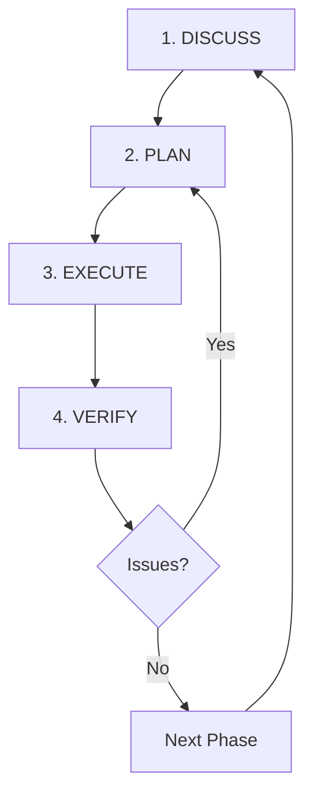

## The Full Lifecycle

GSD structures development into five distinct stages:



Each stage has a specific purpose. Skip a stage, and quality suffers.

## Stage 1: Discuss Phase

**Command:** `/gsd:discuss-phase [N]`

**Purpose:** Capture YOUR vision before Claude makes assumptions

### What Happens

<Steps>
  <Step title="Phase Analysis">
    Claude reads the phase description from ROADMAP.md and analyzes what's being built:
    
    ```
    Phase 03: User Dashboard
    Goal: Users can view and manage their projects
    ```
    
    Identifies gray areas:
    - Layout (grid vs list vs table)
    - Density (compact vs spacious)
    - Interactions (hover states, click behavior)
    - Empty states (what shows when no projects)
  </Step>
  
  <Step title="Targeted Questions">
    For each gray area you select, Claude asks until satisfied:
    
    **Layout:**
    - Grid or list layout?
    - How many columns on desktop/mobile?
    - Card-based or table-based?
    
    **Density:**
    - Show full project details or compact view?
    - Include descriptions in list or detail view only?
    
    **Interactions:**
    - Click project → navigate or expand inline?
    - Hover states on cards?
    - Action buttons (edit/delete) always visible or on hover?
  </Step>
  
  <Step title="Create CONTEXT.md">
    Writes `{phase}-CONTEXT.md` with three sections:
    
    ```markdown
    ## Decisions
    
    [Locked decisions - NON-NEGOTIABLE]
    
    ## Deferred Ideas
    
    [Things user explicitly said NOT to do now]
    
    ## Claude's Discretion
    
    [Areas where user said "use your judgment"]
    ```
  </Step>
</Steps>

### Why It Matters

Without discuss-phase:
```xml
<action>
Create dashboard component showing user's projects.
Use reasonable defaults for layout and interactions.
</action>
```

With discuss-phase:
```xml
<action>
Create dashboard component with:
- 3-column grid on desktop (1 col on mobile)
- Card layout with shadows and hover lift effect
- Project name, description (truncated to 2 lines), last updated
- Edit/delete buttons visible on hover only
- Empty state: "No projects yet" with "Create Project" CTA
- Sort by last updated, newest first
</action>
```

<Tip>
**The deeper you go in discuss-phase, the more the system builds what you actually want.**
</Tip>

### When to Use

<CardGroup cols={2}>
  <Card title="Visual Features" icon="palette">
    Layout, density, interactions, empty states, styling preferences
  </Card>
  
  <Card title="APIs/CLIs" icon="terminal">
    Response format, flags, error handling, verbosity levels
  </Card>
  
  <Card title="Content Systems" icon="file-lines">
    Structure, tone, depth, flow, examples vs theory
  </Card>
  
  <Card title="Organization Tasks" icon="folder-tree">
    Grouping criteria, naming conventions, duplicate handling
  </Card>
</CardGroup>

### When to Skip

Skip discuss-phase when:
- Phase has no ambiguity ("Add field to database")
- You trust Claude's defaults
- Time pressure (can always re-plan)

## Stage 2: Plan Phase

**Command:** `/gsd:plan-phase [N]`

**Purpose:** Research how to build it, create executable plans

### What Happens

<Steps>
  <Step title="Research (Optional)">
    Spawns 4 parallel researchers:
    
    ```
    ┌─────────────────────────────────────────────────┐
    │  Phase Researcher A: Stack                      │
    │  → What libraries exist? Which to use?          │
    │                                                  │
    │  Phase Researcher B: Features                   │
    │  → What features do similar systems have?       │
    │                                                  │
    │  Phase Researcher C: Architecture               │
    │  → How do others structure this?                │
    │                                                  │
    │  Phase Researcher D: Pitfalls                   │
    │  → Common mistakes? What to avoid?              │
    └─────────────────────────────────────────────────┘
                          ↓
                Writes: {phase}-RESEARCH.md
    ```
    
    **Disable:** `/gsd:plan-phase --skip-research` or toggle in settings
  </Step>
  
  <Step title="Planning">
    Planner agent (fresh 200K context) reads:
    - PROJECT.md
    - REQUIREMENTS.md
    - {phase}-CONTEXT.md (your decisions)
    - {phase}-RESEARCH.md (ecosystem knowledge)
    - 2-4 relevant prior SUMMARYs
    
    Creates 2-3 PLAN.md files with:
    - XML task structure
    - Dependency graph
    - Wave assignments
    - Goal-backward must-haves
  </Step>
  
  <Step title="Plan Checking (Optional)">
    Checker agent validates plans against 8 dimensions:
    
    1. **Requirement coverage** — All requirements addressed?
    2. **Task completeness** — Each task has name/files/action/verify/done?
    3. **Dependency correctness** — Wave assignments valid?
    4. **Scope sanity** — Plans fit ~50% context?
    5. **Must-haves derivation** — Frontmatter has goal-backward criteria?
    6. **Key links planned** — Critical connections identified?
    7. **TDD appropriateness** — Test-first where applicable?
    8. **Nyquist validation** — Every task has automated verify command?
    
    **If issues found:** Planner revises (fresh context), checker validates again. Loop up to 3x.
    
    **Disable:** `/gsd:plan-phase --skip-verify` or toggle in settings
  </Step>
  
  <Step title="Commit Plans">
    Writes PLAN.md files to disk, updates ROADMAP.md, commits:
    
    ```bash
    git commit -m "docs(03): create phase plan"
    ```
  </Step>
</Steps>

### Discovery Levels

Planning includes mandatory discovery protocol:

| Level | When | Action | Time |
|-------|------|--------|------|
| **Level 0** | Pure internal work, existing patterns | Skip discovery | 0 min |
| **Level 1** | Single known library, syntax check | Context7 query | 2-5 min |
| **Level 2** | Choosing between 2-3 options | Full research workflow | 15-30 min |
| **Level 3** | Architectural decision, novel problem | Deep dive research | 1+ hour |

<Info>
For niche domains (3D, games, audio, shaders, ML), GSD suggests `/gsd:research-phase` before planning.
</Info>

### Wave Structure Example

```yaml
# Phase 03: Dashboard Plans

Plan 01: Create project model and API
  depends_on: []
  wave: 1
  files: [src/models/project.ts, src/api/projects.ts]

Plan 02: Create user preferences model and API
  depends_on: []
  wave: 1
  files: [src/models/preferences.ts, src/api/preferences.ts]

Plan 03: Create dashboard UI
  depends_on: [01, 02]
  wave: 2
  files: [src/components/Dashboard.tsx]
```

**Result:** Plans 01 and 02 run in parallel (Wave 1), Plan 03 waits for both (Wave 2).

## Stage 3: Execute Phase

**Command:** `/gsd:execute-phase <N>`

**Purpose:** Run plans in parallel waves, commit atomically

### What Happens

<Steps>
  <Step title="Wave Analysis">
    Orchestrator reads frontmatter from all PLAN.md files:
    
    ```yaml
    plan: 01
    wave: 1
    depends_on: []
    
    plan: 02
    wave: 1
    depends_on: []
    
    plan: 03
    wave: 2
    depends_on: [01, 02]
    ```
    
    Groups plans by wave, sorts by dependencies.
  </Step>
  
  <Step title="Wave 1 Execution">
    Spawns executor agents in parallel:
    
    ```
    ┌─────────────────────────────────────────────────┐
    │  Executor A: Plan 01 (fresh 200K context)      │
    │  → Task 1 → commit                              │
    │  → Task 2 → commit                              │
    │  → Task 3 → commit                              │
    │  → Create SUMMARY.md                            │
    │                                                  │
    │  Executor B: Plan 02 (fresh 200K context)      │
    │  → Task 1 → commit                              │
    │  → Task 2 → commit                              │
    │  → Create SUMMARY.md                            │
    └─────────────────────────────────────────────────┘
    ```
    
    Both run simultaneously. Orchestrator waits for both to complete.
  </Step>
  
  <Step title="Wave 2 Execution">
    After Wave 1 complete, spawns Wave 2 executors:
    
    ```
    ┌─────────────────────────────────────────────────┐
    │  Executor C: Plan 03 (fresh 200K context)      │
    │  → Reads: 01-SUMMARY.md, 02-SUMMARY.md         │
    │  → Task 1 → commit                              │
    │  → Task 2 → commit                              │
    │  → Create SUMMARY.md                            │
    └─────────────────────────────────────────────────┘
    ```
  </Step>
  
  <Step title="Verification (Optional)">
    After all waves complete, spawns verifier agent:
    
    - Reads all SUMMARY.md files
    - Checks must_haves from PLAN frontmatter
    - Inspects codebase for artifacts, key links
    - Writes VERIFICATION.md with pass/fail per must-have
    
    **Disable:** Toggle `workflow.verifier: false` in settings
  </Step>
</Steps>

### Deviation Handling

Executors apply rules automatically:

<AccordionGroup>
  <Accordion title="Rule 1: Auto-fix bugs">
    **Trigger:** Code doesn't work (errors, incorrect output)
    
    **Action:** Fix → update tests → verify → continue → track deviation
    
    **Example:** Wrong SQL query causing 500 errors → fix query, add test, commit
  </Accordion>
  
  <Accordion title="Rule 2: Auto-add missing critical functionality">
    **Trigger:** Code missing essential features for correctness/security
    
    **Action:** Add → test → verify → continue → track deviation
    
    **Example:** Protected route with no auth check → add requireAuth() middleware
  </Accordion>
  
  <Accordion title="Rule 3: Auto-fix blocking issues">
    **Trigger:** Something prevents completing current task
    
    **Action:** Fix → test → verify → continue → track deviation
    
    **Example:** Missing TypeScript type causing build errors → create type definition
  </Accordion>
  
  <Accordion title="Rule 4: Ask about architectural changes">
    **Trigger:** Fix requires significant structural modification
    
    **Action:** STOP → return checkpoint with proposal → await user decision
    
    **Example:** Plan says "add column" but executor realizes need new table → checkpoint
  </Accordion>
</AccordionGroup>

<Note>
All deviations are documented in SUMMARY.md. Plans are guides, not scripts.
</Note>

### Checkpoints

When executor hits `type="checkpoint:*"`:

1. Completes all automation BEFORE checkpoint
2. Pauses execution
3. Returns structured message:

```markdown
## CHECKPOINT REACHED

**Type:** human-verify
**Plan:** 03-02
**Progress:** 2/3 tasks complete

### Completed Tasks

| Task | Commit | Files |
|------|--------|-------|
| 1 | abc123f | src/components/Dashboard.tsx |
| 2 | def456g | src/api/projects.ts |

### Current Task

**Task 3:** Verify dashboard UI
**Status:** awaiting verification

### How to Verify

1. Visit http://localhost:3000/dashboard
2. Verify projects display in 3-column grid
3. Hover over project card - edit/delete buttons appear
4. Click project - navigates to detail page
5. Check empty state when no projects

### Awaiting

Type "approved" or describe issues
```

4. Fresh continuation agent spawned after approval

<Tip>
In auto mode (`workflow.auto_advance: true`), `checkpoint:human-verify` and `checkpoint:decision` are auto-approved. Only `checkpoint:human-action` (auth gates) pause execution.
</Tip>

### Atomic Commits

Each task gets its own commit immediately after completion:

```bash
feat(03-01): create project model
feat(03-01): create projects API endpoint
feat(03-01): add project filtering and sorting
```

See [Atomic Commits](/concepts/atomic-commits) for details.

## Stage 4: Verify Work

**Command:** `/gsd:verify-work [N]`

**Purpose:** Manual user acceptance testing with auto-diagnosis

### What Happens

<Steps>
  <Step title="Extract Testable Deliverables">
    Claude reads:
    - Phase must_haves from PLAN frontmatter
    - Success criteria from PLAN files
    - VERIFICATION.md (automated checks)
    
    Creates list of things you should be able to DO now:
    
    ```markdown
    1. User can view list of projects
    2. User can create new project
    3. User can edit project details
    4. User can delete project
    5. Empty state shows when no projects
    ```
  </Step>
  
  <Step title="Walk Through Each">
    For each deliverable:
    
    ```
    Claude: Can you view list of projects?
    You: yes
    
    Claude: Can you create new project?
    You: no - form submit does nothing
    
    Claude: [Spawns debugger agent]
    Debugger: [Analyzes code, finds missing API call]
    Debugger: [Creates fix plan]
    
    Claude: Fix plan ready. Run /gsd:execute-phase 3 --gaps-only
    ```
  </Step>
  
  <Step title="Create UAT.md">
    Documents results:
    
    ```yaml
    ---
    phase: 03
    status: diagnosed
    passed: 4
    failed: 1
    ---
    
    ## Passed
    
    - [x] User can view list of projects
    - [x] User can edit project details
    - [x] User can delete project
    - [x] Empty state shows when no projects
    
    ## Failed
    
    - [ ] User can create new project
      - Issue: Form submit does nothing
      - Root cause: Missing API call in handleSubmit
      - Fix plan: 03-04-PLAN.md
    ```
  </Step>
</Steps>

### Why Manual Testing?

Automated verification checks:
- ✅ Code exists
- ✅ Tests pass
- ✅ Key files present

But does it **work** the way you expected?

<Info>
Verify-work is where you confirm the feature actually does what you wanted. GSD automates the diagnosis and fix planning when issues are found.
</Info>

## Stage 5: Repeat

After verify-work:

<Steps>
  <Step title="Issues Found?">
    Run `/gsd:execute-phase [N]` again with gap closure plans:
    
    ```bash
    /gsd:execute-phase 3
    # Orchestrator detects UAT.md with diagnosed status
    # Runs only gap closure plans (03-04, 03-05...)
    ```
    
    Then `/gsd:verify-work 3` again
  </Step>
  
  <Step title="Phase Complete?">
    Move to next phase:
    
    ```bash
    /gsd:discuss-phase 4
    /gsd:plan-phase 4
    /gsd:execute-phase 4
    /gsd:verify-work 4
    ```
  </Step>
  
  <Step title="All Phases Complete?">
    Audit and complete milestone:
    
    ```bash
    /gsd:audit-milestone
    # Checks all requirements delivered
    # Identifies any stubs or gaps
    
    /gsd:plan-milestone-gaps  # If gaps found
    /gsd:execute-phase [gaps]
    
    /gsd:complete-milestone
    # Archives milestone
    # Tags release
    ```
  </Step>
  
  <Step title="Next Milestone?">
    Start fresh cycle:
    
    ```bash
    /gsd:new-milestone "v2.0 - Advanced Features"
    # Same flow as new-project but for existing codebase
    # Questions → research → requirements → roadmap
    ```
  </Step>
</Steps>

## Full Workflow Diagram

```
┌──────────────────────────────────────────────────┐
│                   NEW PROJECT                    │
│  /gsd:new-project                                │
│  Questions -> Research -> Requirements -> Roadmap│
└─────────────────────────┬────────────────────────┘
                          │
           ┌──────────────▼─────────────┐
           │      FOR EACH PHASE:       │
           │                            │
           │  ┌────────────────────┐    │
           │  │ /gsd:discuss-phase │    │  <- Lock in preferences
           │  └──────────┬─────────┘    │
           │             │              │
           │  ┌──────────▼─────────┐    │
           │  │ /gsd:plan-phase    │    │  <- Research + Plan + Verify
           │  └──────────┬─────────┘    │
           │             │              │
           │  ┌──────────▼─────────┐    │
           │  │ /gsd:execute-phase │    │  <- Parallel execution
           │  └──────────┬─────────┘    │
           │             │              │
           │  ┌──────────▼─────────┐    │
           │  │ /gsd:verify-work   │    │  <- Manual UAT
           │  └──────────┬─────────┘    │
           │             │              │
           │     Next Phase?────────────┘
           │             │ No
           └─────────────┼──────────────┘
                         │
         ┌───────────────▼──────────────┐
         │  /gsd:audit-milestone        │
         │  /gsd:complete-milestone     │
         └───────────────┬──────────────┘
                         │
                Another milestone?
                    │          │
                   Yes         No -> Done!
                    │
            ┌───────▼──────────────┐
            │  /gsd:new-milestone  │
            └──────────────────────┘
```

## Quick Mode

**Command:** `/gsd:quick`

**Purpose:** Ad-hoc tasks without full planning ceremony

Skips:
- Research phase
- Plan checking
- Verification stage

Keeps:
- Context engineering
- Atomic commits
- State tracking
- Deviation rules

```bash
/gsd:quick
> What do you want to do? "Fix dashboard loading spinner"

# Creates: .planning/quick/001-fix-dashboard-spinner/
#          PLAN.md, SUMMARY.md
```

Use for: Bug fixes, small features, config changes, one-off tasks.

## Best Practices

<CardGroup cols={2}>
  <Card title="/clear between stages" icon="broom">
    Run `/clear` after plan-phase, before execute-phase. Orchestrator spawns fresh agents anyway.
  </Card>
  
  <Card title="Discuss visual features" icon="palette">
    Always run discuss-phase for UI work. Layout, interactions, styling — these need your input.
  </Card>
  
  <Card title="Let verification happen" icon="check-double">
    Don't skip verify-work. It catches issues early and creates fix plans automatically.
  </Card>
  
  <Card title="Trust the waves" icon="wave-square">
    GSD automatically parallelizes. Prefer vertical slices (full features) over horizontal layers (all models, then APIs, then UI).
  </Card>
</CardGroup>

## Next Steps

<CardGroup cols={2}>
  <Card title="Atomic Commits" icon="git-alt" href="/concepts/atomic-commits">
    Learn how each task becomes a traceable commit
  </Card>
  
  <Card title="Quickstart" icon="rocket" href="/quickstart">
    Try the full workflow on a sample project
  </Card>
</CardGroup>